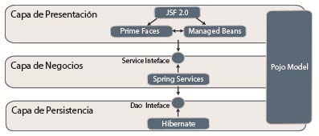

# Plataforma de Historial de Equipos
 
**Curso:** Ciclos de Vida del Desarrollo de Software \
**Periodo académico:** 2019-1

## Integrantes y Roles

|     Nombre    |     Rol         |
|:--------------:|:-------------: |
|Santiago Alzate|Product Owner    |
|Nicolas Cortes |Team Developer   |
|Andrés Quintero|Team Developer   |
|Julián Benítez |Team Developer   |

## Estado del Proyecto

## Descripción del Producto

#### Descripción General
Esta aplicación tiene el objetivo principal de brindar a el personal del laboratorio
LabInfo las herramientas necesarias para registrar los laboratorios, equipos y elementos de 
los mismos. Cuenta con reportes los cuales permiten al personal revisar novedades y/o cambios
en los laboratorios, equipos y elementos.

#### Manual de Usuario
Para poder utilizar los servicios que ofrece la página es necesario iniciar sesión.
Las credenciales para ingresar son las siguientes:
+ **Usuario:** *claudia.santiago@escuelaing.edu.co*
+ **Contraseña:** *admin*

Ver [funcionalidades importantes.](resources/markdowns/funcionalidades/funcionalidad.md)

## Arquitectura y Diseño

#### Modelo E-R

#### Diagrama de Clases (Simplificado)

#### Arquitectura (Capas) y Stack de Tecnología Utilizado
La arquitetura (capas) es similar a como se muestra en la siguiente
imagen:

Se tiene la capa de presentación la cual usa PrimeFaces, BootStrap y los 
Managed Beans.

En la capa de negocios se tiene los servicios que se comunican
con la capa de Persistencia, la cual tiene acceso a la base de datos.

Stack de Tecnologías:
   * [PrimeFaces (Framework)](https://www.primefaces.org/)
   * [QuickTheories (Property Based Testing)](https://github.com/quicktheories/QuickTheories)
   * [Guice (Injección de Dependencias)](https://github.com/google/guice)
   * [Bootstrap (Web Toolkit)](https://getbootstrap.com/)
   * PostgreSQL (DataBase Management)
   

#### Enlaces
+ [Despliegue en Heroku](https://cvds-equipment-history.herokuapp.com/)
+ [Integración Continua (CircleCI)](https://circleci.com/gh/cvds-squad/CVDS-Plataforma-Historial-Equipos)

## Descripción del Proceso
#### Integrantes
|     Nombre    |     Rol         |
|:--------------:|:-------------: |
|Nicolas Cortes |Team Developer   |
|Andrés Quintero|Team Developer   |
|Julián Benítez |Team Developer   |

#### Metodología
Se utilizó la metodoloía Scrum en la cual
el equipo se reune y planea lo que se realizará en el
 Sprint en Taiga.io, se hace mira que se necesita para realizar la historia
 de usuario y se reparte las tareas entre los integrantes.
 
 Al finalizar cada Sprint, el equipo se reune para planear el siguiente y
 se comentan lo que sucedió con el anterior.
 

#### Taiga
[Taiga backlog](https://tree.taiga.io/project/julianbenitez99-historial-de-equipos-labinfo/backlog)

#### Release-burndown chart

## Sprints
Ver la documentación de los [sprints](resources/markdowns/sprints/sprints.md)
