# Funcionalidades Importantes 

## Servicios Ofrecidos
La página cuenta con el los siguientes servicios:
+ **Registrar**
    + [Registrar Elemento](#registrar-elemento)
    + [Registrar Equipo](#registrar-equipo)
    + [Registrar Laboratorio](#registrar-laboratorio)
    + [Registrar Novedad](#registrar-novedad)
    
+ **Dar de Baja**
    + [Dar de Baja Elementos](#dar-de-baja-elementos)
    + [Dar de Baja Equipo](#dar-de-baja-equipos)
    + [Cerrar Laboratorio](#cerrar-laboratorio)
+ **Asociar**
    + [Asociar Elementos](#asociar-elementos)
    + [Asociar Equipos](#asociar-equipos)
+ **Desasociar**
    + [Desasociar Equipos](#desasociar-equipos)
+ **Reportes**
    + [Reporte de Elementos](#reporte-de-laboratorios)
    + [Reporte de Laboratorios](#reporte-de-laboratorios)
    + [Reporte Histórico de Novedades](#reporte-histrico-de-novedades)

## Registrar

### Registrar Elemento
Al escoger esta opción al usuario irá a una página en la cual se muestra el siguiente formulario:

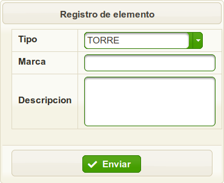

El usuario rellena estos campos y registra el elemento. Al finalizar un mensaje indica si fue exitoso el registro del elemento.

Al usuario también se le muestra los elementos registrados en la base de datos de la siguiente forma

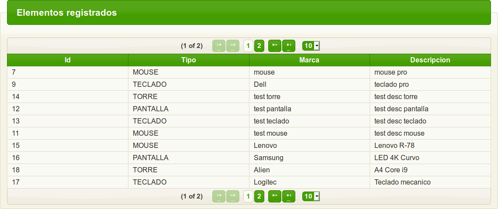

### Registrar Equipo
Al escoger esta opción al usuario irá a una página en la cual se muestra el siguiente formulario:

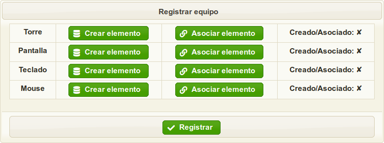

El usuario puede decidir si crear elemento o asociar uno ya existente.
Al finalizar un mensaje indica si fue exitoso el registro del equipo.

Al usuario se le brinda una tabla con los equipos registrados:

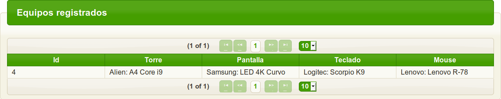

### Registrar Laboratorio
Para registrar un laboratorio al usuario se le solicita que rellene los siguientes campos.
En el cual también podrá asociar equipos disponibles a éste:

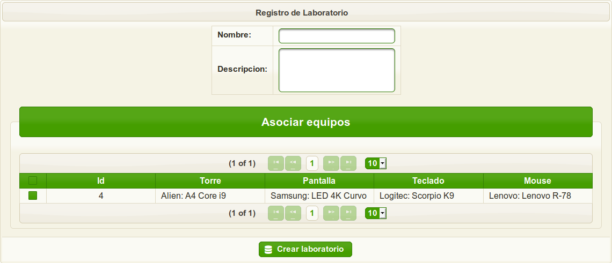

Al finalizar se muestra un mensaje el cual indica si fue exitoso la creación del laboratorio.

Al usuario se le muestra una tabla con los laboratorios registrados.

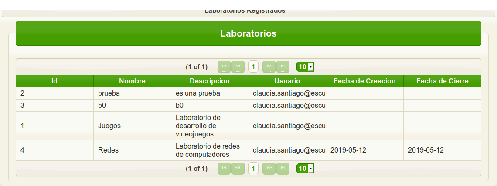

### Registrar Novedad

Al registrar una novedad, al usuario se le presentan dos opciones, una es registrar la novedad sobre un elemento y la otra sobre un equipo

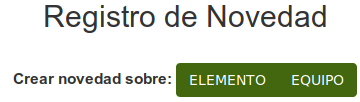

Al seleccionar la opción de elemento se despliega el siguiente formulario:

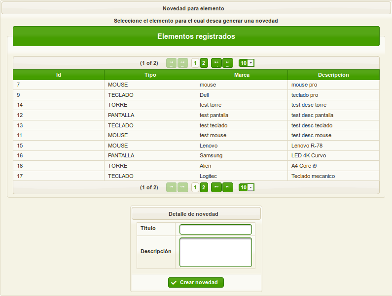

El usuario selecciona un elemento y crea la novedad.

Al seleccionar la opción de equipo se despliega el siguiente formulario:

El usuario selecciona un equipo y crea la novedad.

## Dar de Baja

### Dar de Baja Elementos

Se pueden seleccionar varios elementos para dar de baja, se pedirá la confirmación del
usuario y se actualizará la tabla de elementos dados de baja.

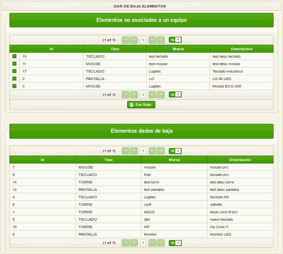

### Dar de Baja Equipos

Se puede seleccionar el equipo a dar de baja

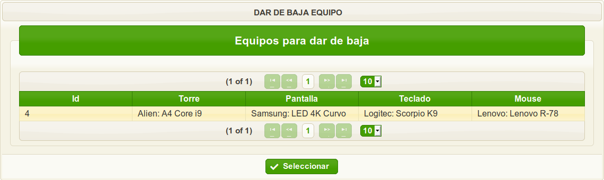

Una vez seleccionado se le pregunta al usuario sobre lo que se desea hacer con sus elementos.

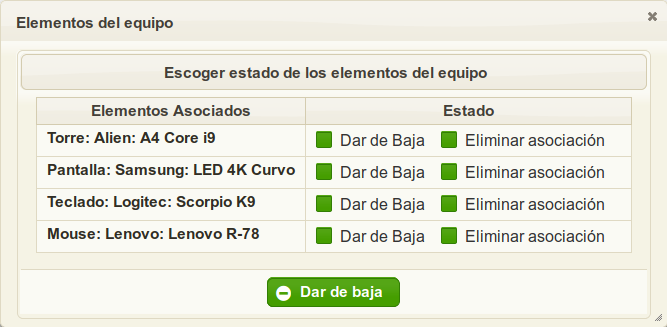

Se finalizará con un mensaje el cual indica si se pudo realizar la eliminación del equipo.

### Cerrar Laboratorio

Se selecciona el laboratorio que desea ser cerrado. Se le pregunta al usuario confirmación.

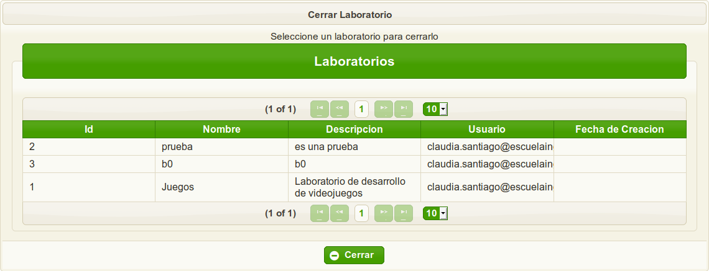

Una vez cerrado, se desasocian todos sus equipos, además los laboratorios
 se muestran en la tabla de Laboratorios Cerrados
 
 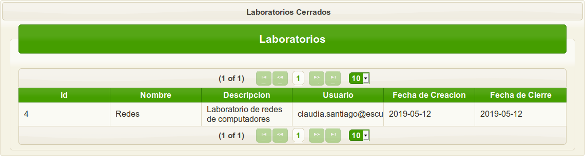
 

## Asociar

### Asociar Elementos

El usuario selecciona un equipo al que le desee asociar elementos. Si un elemento
de un tipo específico ya estaba asociado, este es reemplazado por el escogido.

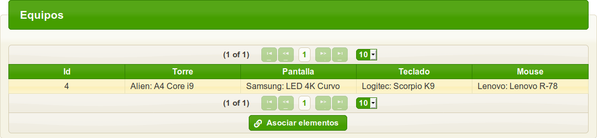

Una vez seleccionado aparecen los elementos disponibles.

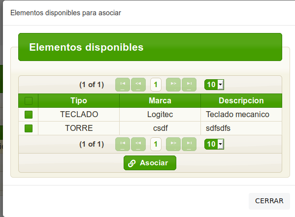

### Asociar Equipos

El usuario selecciona un laboratorio al que le desee asociar equipo.

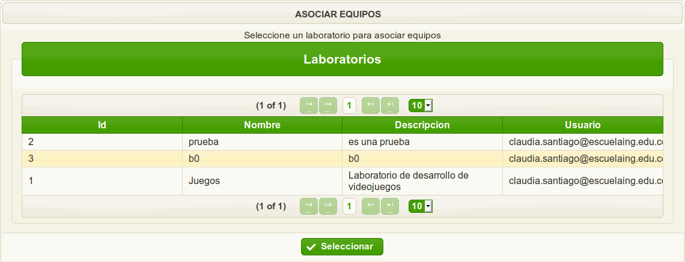

Aparecerá una pantalla la cual muestra los equipos disponibles para asociar.

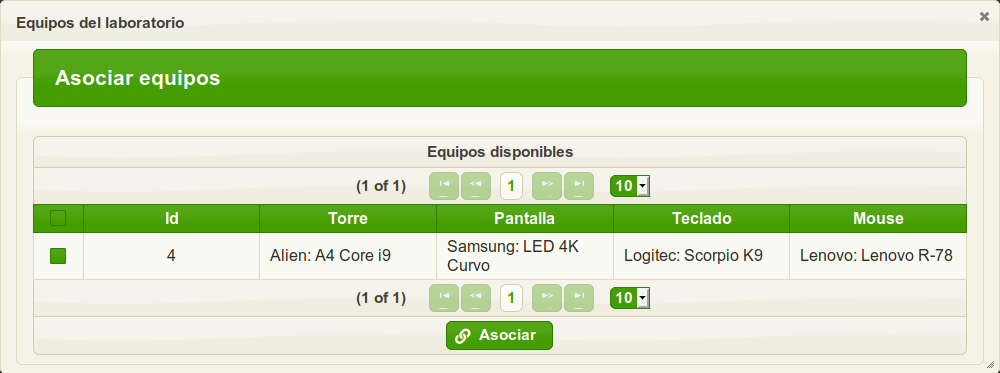

## Desasociar

### Desasociar Equipos

Se selecciona el laboratorio al cual deseamos realizar la asociación de equipos.

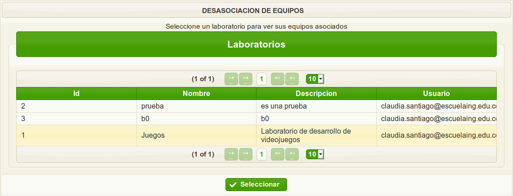

Se abrirá un modal con los equipos del laboratorio.

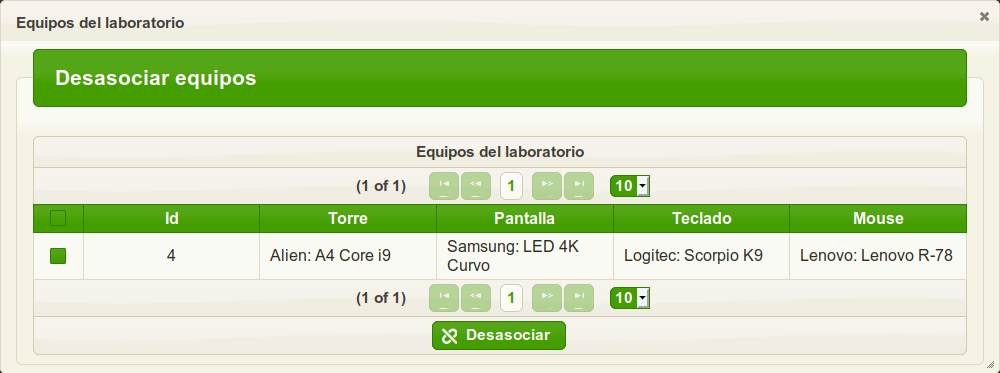

## Reportes

### Reporte de Elementos

Se muestra una tabla con todos los elementos que se han registrado en el aplicativo. 
Los elementos de la tabla se pueden filtrar por la mayoría de sus columnas, además la información
puede ser exportada a formato .xlsx. 

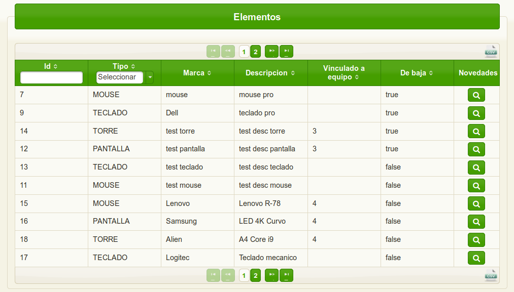

Al presionar el boton de novedades del elemento se muestran todas las novedadas asociadas a este.

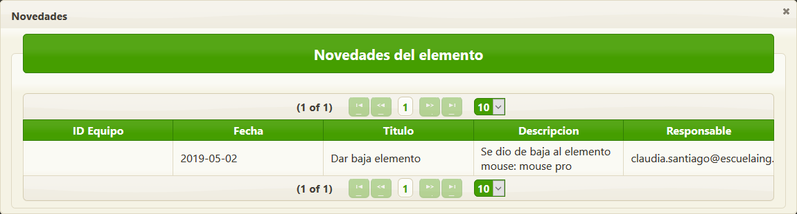

Al administrar el elemento podemos dar de baja a este.

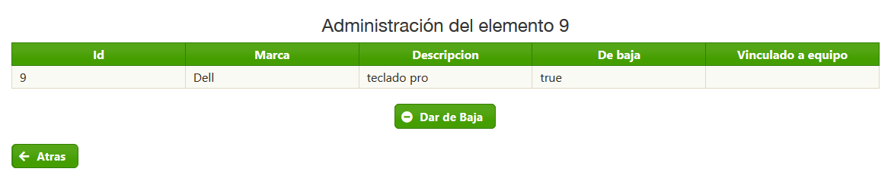

### Reporte de Laboratorios

El reporte de laboratorio posee una gráfica la cual muestra el porcentaje de laboratorios abiertos y cerrados.
También cuenta con la opción de ser exportado como imagen.
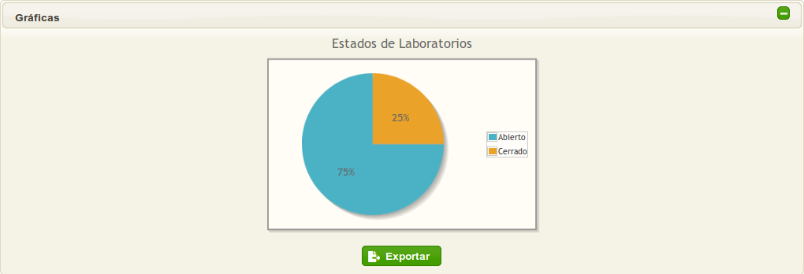

Se muestra una tabla la cual puede ordenarse por el ID, nombre y si está activo. Provee la opción de ser
exportado a formato .xlsx.

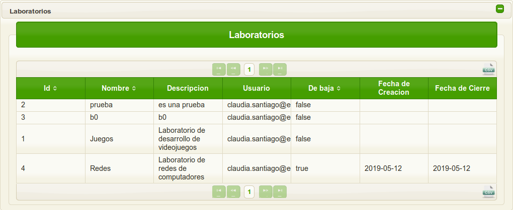

### Reporte Histórico de Novedades

Se muestra una tabla la cual está ordenada por la fecha de adición,
la tabla está paginada para facilitar su visualización, además cuenta con la opción
para ser exportada a formato .xlsx.

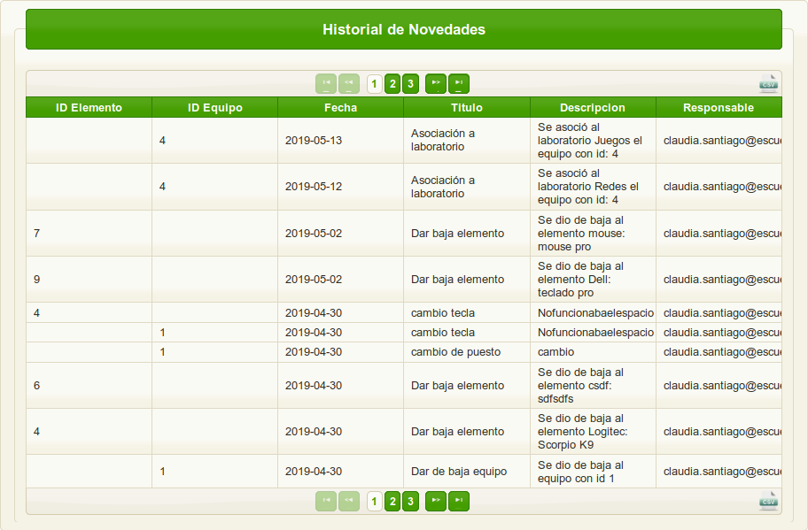
