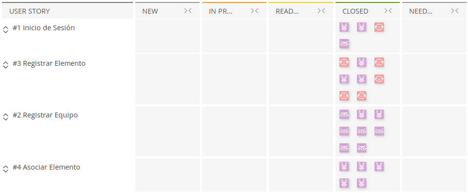
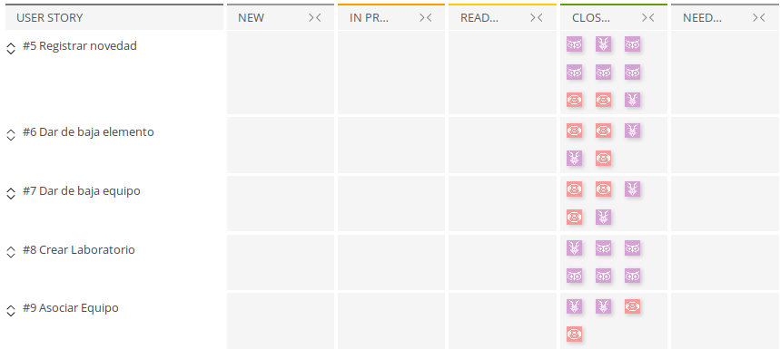
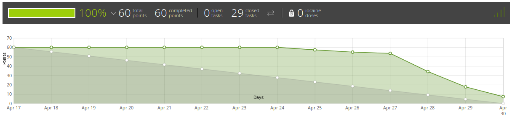

# Sprints
### Sprint 1
**Sprint-backlog**\

**Sprint-burndown chart**\

##### Resumen del sprint
Para este primer sprint tardamos tiempo en reunirnos, por lo cual el burndown-chart empieza a 
cambiar unos días después. El equipo trabajo de acuerdo a lo planeado y se logró terminar un día antes de la
finalización del sprint.

### Sprint 2
**Sprint-backlog**\

**Sprint-burndown chart**\

##### Resumen del sprint
Para este sprint, comenzamos tarde, por lo cual tuvimos que realizar las tareas de cada uno
lo más rápido posible para entregar a tiempo. Aunque en la gráfica aparezca como que faltó tareas,
en realidad acabamos el sprint antes de que este finalizara.
Tras cada Sprint se suele mejorar algunos detalles de los anteriores. 

### Sprint 3

#### Resumen del sprint